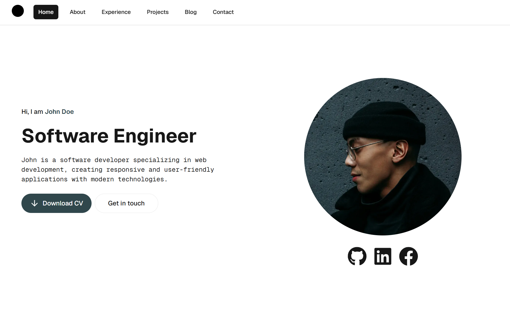

# Developer Portfolio

<p align="center">

</p>

## A modern, accessible, and customisable portfolio template for developers built with Next.js 15, React 19, TypeScript, and Tailwind CSS.

[](https://nextjs.org/)
[](https://react.dev/)
[](https://www.typescriptlang.org/)
[](https://tailwindcss.com/)
[](https://turbo.build/pack)
[](https://vercel.com/)

## 📢 Latest Update

**Version 0.2.0** - _17/07/25_  
🎉 **New Skills Component**: Introducing a fully interactive skills showcase with carousel functionality, accessibility features, and comprehensive customisation options.

<details>
<summary><strong>Previous Updates</strong></summary>

**Version 0.1.0** - _07/05/25_  
🚀 **MVP Release**: Initial release of the developer portfolio template with core functionality including responsive design, dark mode support, contact form integration, and essential customisation options.

</details>

<br />

## Table of Contents 📑

- [Features](#features-)
- [Demo](#demo-)
- [Tech Stack](tech-stack-%EF%B8%8F)
- [Getting Started](#getting-started-)
  - [Forking the Repository](#forking-the-repository)
  - [Installation](#installation)
  - [Basic Configuration](#basic-configuration)
  - [Running Locally](#running-locally)
- [Customisation](#customisation-%EF%B8%8F)
  - [Essential Customisation](#essential-customisation)
  - [Optional Customisation](#optional-customisation)
- [Coming Soon](#coming-soon-)
- [Theme Options](#theme-options-)
- [EmailJS Setup](#emailjs-setup-%EF%B8%8F)
- [Deployment](#deployment-)
- [Accessibility](#accessibility-)
- [SEO Optimisation](#seo-optimisation-)
- [Contributors](#contributors-)
- [License](#license-)

<br />

## Features ✨

- **Modern Tech Stack**: Built with Next.js 15, React 19, TypeScript, and Tailwind CSS
- **Fast Development**: Powered by Turbopack for a lightning-fast development experience
- **Responsive Design**: Looks great on all devices, from mobile to desktop
- **Dark Mode Support**: Automatic dark mode based on user preferences
- **Accessibility**: WCAG compliant with keyboard navigation and screen reader support
- **SEO Optimised**: Built-in SEO best practices with structured data
- **Contact Form**: Integrated with EmailJS for easy contact form setup
- **Performance**: Optimised for Core Web Vitals and fast-loading
- **Type Safety**: Full TypeScript support for a robust development experience
- **Easy Customisation**: Simple data files to customise your portfolio
- **Vercel Ready**: Optimized for deployment on Vercel

<br />

## Demo 🎬

Visit the [live demo](https://developer-portfolio-xi-three.vercel.app/) to see the portfolio in action.

<br />

## Tech Stack ⚙️

This portfolio template is built with the following:

- **[Next.js 15](https://nextjs.org/)**: React framework with App Router for improved routing and server components
- **[React 19](https://react.dev/)**: Latest version with improved performance and features
- **[TypeScript](https://www.typescriptlang.org/)**: For type safety and better developer experience
- **[Tailwind CSS 4](https://tailwindcss.com/)**: Utility-first CSS framework for rapid UI development
- **[Turbopack](https://turbo.build/pack)**: Incremental bundler for faster development
- **[EmailJS](https://www.emailjs.com/)**: Client-side email sending for the contact form
- **[Headless UI](https://headlessui.com/)**: Accessible UI components styled with Tailwind CSS
- **[React Icons](https://react-icons.github.io/react-icons/)**: Popular icon sets as React components

<br />

## Getting Started 🚀

### Forking the Repository

1. Go to [fork page](https://github.com/doilyuser/developer-portfolio/fork)
2. Give your fork a name (e.g., "my-portfolio")
3. Click "Create fork"

### Installation

Clone your forked repository and install dependencies:

```bash
# Clone your fork
git clone https://github.com/YOUR_USERNAME/my-portfolio.git
cd my-portfolio

# Install dependencies
npm install
```

### Basic Configuration

1. **Update Personal Information**:
   Edit the following files to add your information:
   - `src/data/contact.data.ts`: Your name and contact details
   - `src/data/landing.data.ts`: Your introduction and social links
   - `src/app/layout.tsx`: Update the metadata with your name and description

2. **Replace Images**:
   - Replace `public/images/profile.png` with your profile picture
   - Replace `public/images/og-image.png` with your custom Open Graph image
   - Replace `public/images/logo.svg` with your logo
   - Replace `public/assets/cv.pdf` with your resume/CV
   - Update `src/app/favicon.ico` with your favicon

3. **Configure EmailJS** (see [EmailJS Setup](#emailjs-setup-%EF%B8%8F) section below)

### Running Locally

Start the development server with Turbopack:

```bash
npm run dev
```

Visit [http://localhost:3000](http://localhost:3000) to see your portfolio.

<br />

## Customisation 🎛️

### Essential Customisation

1. **Personal Information**:
   - Update your name, title, and description in `src/data/landing.data.ts`
   - Update contact information in `src/data/contact.data.ts`
   - Update social media links in `src/data/landing.data.ts`

2. **Navigation**:
   - Navigation items and rendered components are handled in `src/data/home.data.ts`
   - Enable/disable sections by setting boolean values in the `homeSections` object
   - Customise navigation labels in `src/data/navigation.data.ts`

3. **Logo**:
   - Replace `public/images/logo.svg` with your logo
   - Update the `orientation` value in `src/data/navigation.data.ts` to match your logo's shape

4. **Images**:
   - Replace `public/images/profile.png` with your profile picture (recommended: 800x800px)
   - Replace `public/images/og-image.png` with your custom Open Graph image (recommended: 1200x630px)
   - Update `src/app/favicon.ico` with your favicon

5. **Resume/CV**:
   - Replace `public/assets/cv.pdf` with your resume/CV

### Optional Customisation

1. **Theme Colours**:
   - Customise colours in `src/app/globals.css`
   - Use a colour from your profile picture for a cohesive look (see tip in `profile.png.example`)
   - See [Theme Options](#theme-options-) for examples.

2. **SEO**:
   - Update metadata in `src/app/layout.tsx`
   - Customise keywords for better search engine visibility
   - Update structured data in `src/data/schema.data.ts`

3. **Components**:
   The portfolio includes several useful components and corresponding data files:

   **Fully Implemented Components:**
   - **Landing.tsx** (`src/data/landing.data.ts`): Configure your profile, introduction, social links, and CV download
   - **Skills.tsx** (`src/data/skills.data.ts`): Interactive carousel with 50+ technology icons. Enable/disable skills by setting `display: true/false`
   - **Contact.tsx** (`src/data/contact.data.ts`): Contact form, personal contact information, and consent settings. Ensure your [EmailJS Setup](#emailjs-setup-%EF%B8%8F) is correct before enabling.

   **Placeholder Components** (coming in future updates):
   - About, Education, Experience, Projects, Achievements, Services, Testimonials, Blog

   Where further configuration is necessary, it will be detailed through inline comments in the corresponding data files.

4. **Content Sections**:
   - Customise content in the respective data files:
     - `src/data/about.data.ts`
     - `src/data/experience.data.ts`
     - `src/data/projects.data.ts`
     - `src/data/skills.data.ts`
     - `src/data/blog.data.ts`

5. **Footer**:
   - Enable/disable the footer in `src/data/footer.data.ts`

6. **Privacy Policy & Terms and Conditions**:
   - Add links to your privacy policy and terms and conditions in `src/data/contact.data.ts`
   - These will appear in the contact form's consent section

<br />

## Coming Soon 🚧

The following components are currently placeholders and will be fully implemented in future updates:

- **About**: Personal background and story
- **Education**: Academic qualifications and certifications
- **Experience**: Professional work history and roles
- **Projects**: Portfolio of completed projects and/or case studies
- **Achievements**: Awards, recognitions, and notable accomplishments
- **Services**: Professional services offered
- **Testimonials**: Client and/or colleague recommendations
- **Blog**: Article previews and links

<br />

## Theme Options 🎨

Easily modify your portfolio's theme by changing the colour variables in `src/app/globals.css`.

### [Copacabana](https://colorkit.co/color/006d8c/) Blue

<div style="display: flex; justify-content: space-between;">
    
    
</div>

### [Little Mermaid](https://colorkit.co/color/30474c/) Grey

<div style="display: flex; justify-content: space-between;">
    
    
</div>

### [Track and Field](https://colorkit.co/color/d46956/) Orange **(default)**

<div style="display: flex; justify-content: space-between;">
    
    
</div>

### [Torrefacto Roast](https://colorkit.co/color/551f1c/) Red

<div style="display: flex; justify-content: space-between;">
    
    
</div>

### [Mustard Seed](https://colorkit.co/color/c69524/) Yellow

<div style="display: flex; justify-content: space-between;">
    
    
</div>

<br />

## EmailJS Setup ✉️

The contact form uses EmailJS to send emails directly from the client side without requiring a backend server. An example email template is included in the repository.

### Setup Steps

1. Create a free account at [EmailJS](https://www.emailjs.com/)
2. Create a new Email Service (Gmail, Outlook, etc.)
3. Create a new Email Template or use the example template provided in `examples/email-template.html`
   - Make sure to include the following variables:
     - `{{name}}`: Sender's name
     - `{{email}}`: Sender's email
     - `{{message}}`: Message content
4. Get your Service ID, Template ID, and Public Key from the EmailJS dashboard
5. Create a `.env.local` file in the root directory with the following variables:
   ```
   NEXT_PUBLIC_SERVICE_ID=your_service_id
   NEXT_PUBLIC_TEMPLATE_ID=your_template_id
   NEXT_PUBLIC_PUBLIC_KEY=your_public_key
   ```
6. Restart your development server

<br />

## Deployment 🌐

This portfolio is optimised for deployment on [Vercel](https://vercel.com/) but can be deployed on any platform that supports Next.js.

### Deploying to Vercel

1. Create an account on [Vercel](https://vercel.com/)
2. Connect your GitHub account
3. Import your portfolio repository
4. Add your environment variables (for EmailJS)
5. Click "Deploy"

Vercel will automatically detect that you're using Next.js and configure the build settings accordingly:

<p align="center">

</p>

### Other Deployment Options

- **Netlify**: Follow the [Netlify deployment guide for Next.js](https://docs.netlify.com/integrations/frameworks/next-js/overview/)
- **GitHub Pages**: Use the [next-github-pages](https://github.com/vercel/next.js/tree/canary/examples/github-pages) example
- **AWS Amplify**: Follow the [AWS Amplify deployment guide](https://docs.amplify.aws/guides/hosting/nextjs/q/platform/js/)

<br />

## Accessibility 🦾

This portfolio template is built with accessibility in mind:

- **Semantic HTML**: Proper use of HTML elements for better structure
- **ARIA attributes**: Enhanced screen reader support
- **Keyboard navigation**: Full keyboard accessibility
- **Focus management**: Proper focus handling for interactive elements
- **Colour contrast**: WCAG AA-compliant colour contrast
- **Responsive design**: Accessible on all device sizes
- **Screen reader announcements**: Dynamic content changes are announced to screen readers
- **Form labels**: All form inputs have associated labels

<br />

## SEO Optimisation 🔍

This portfolio is optimised for search engines:

- **Metadata**: Customisable title, description, and keywords
- **Structured Data**: JSON-LD schema for better search engine understanding
- **OpenGraph**: Social media sharing optimisation
- **Twitter Cards**: Twitter-specific metadata
- **Canonical URLs**: Prevents duplicate content issues
- **Semantic HTML**: Helps search engines understand your content
- **Responsive Design**: Mobile-friendly (a ranking factor)
- **Performance**: Fast loading times (a ranking factor)
- **robots.txt**: Customisable file to control search engine crawling behaviour

<br />

## Contributors 👯

### Photography

Stock photos used in examples sourced from [Unsplash](https://unsplash.com/):

- [Charles Deluvio](https://unsplash.com/@charlesdeluvio)
- [Lance Reis](https://unsplash.com/s/photos/lance-reis)
- [Maeva Vigier](https://unsplash.com/s/photos/maeva-vigier)
- [Toa Heftiba](https://unsplash.com/s/photos/toa-heftiba)

<br />

## License 📄

This project is licensed under the MIT License - see the [LICENSE](LICENSE) file for details.
